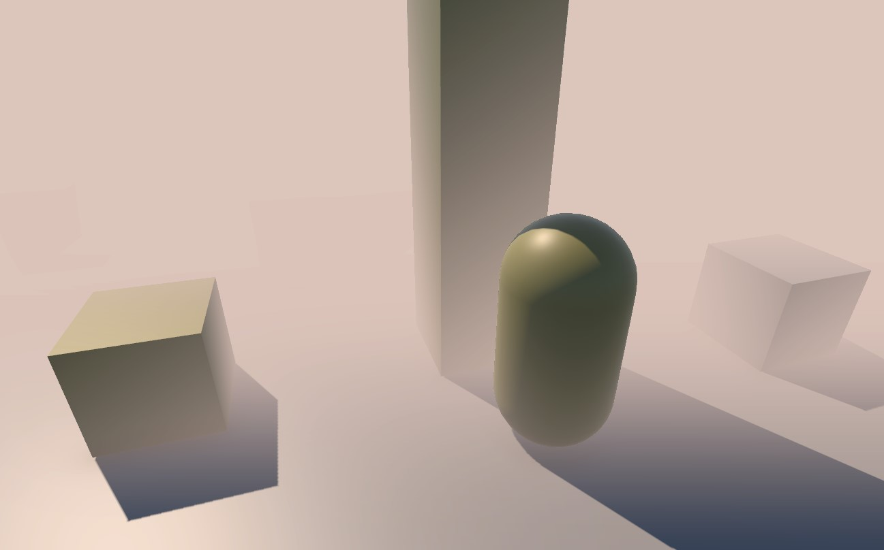
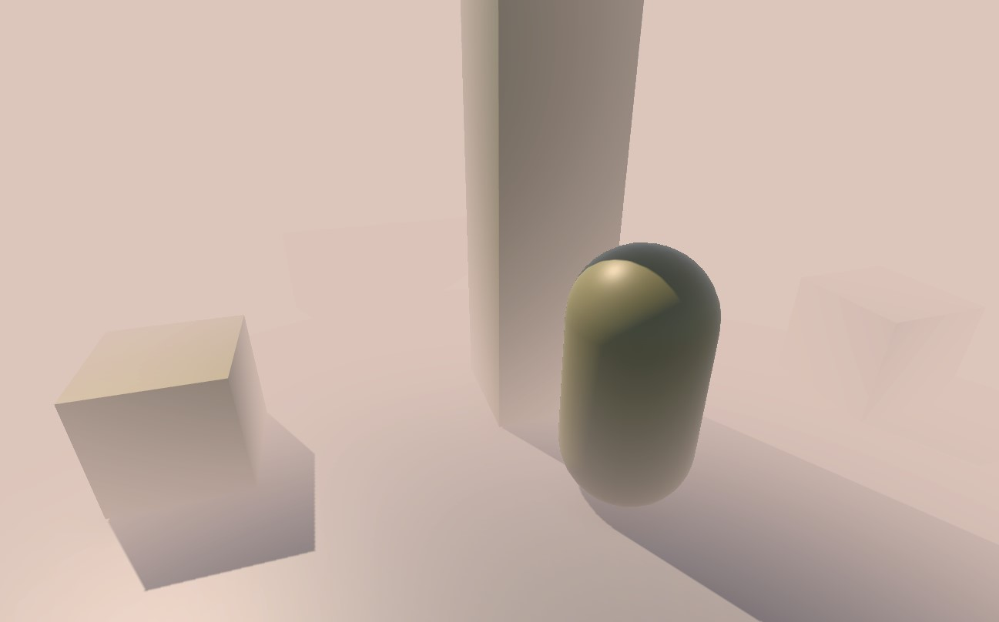
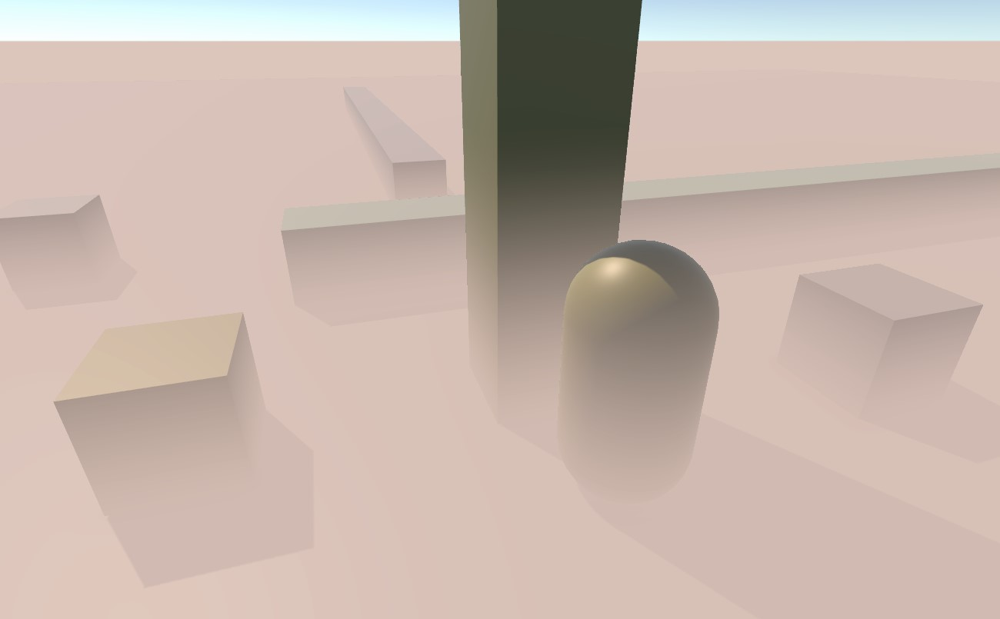
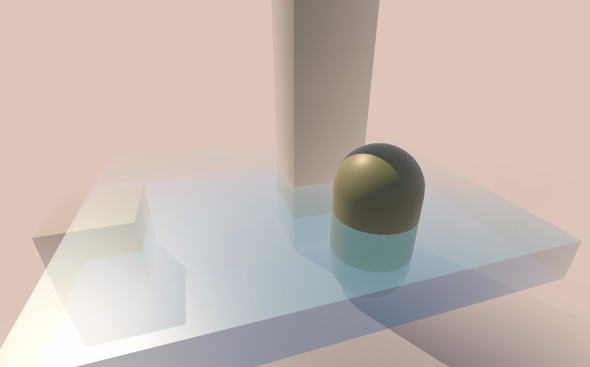

# Simple Fog Effects For URP

This project will provide some URP-based fog effects, and implement it in a relatively quick way.

## Installation

- Install via UPM git URL

  `https://github.com/meryuhi/URPFog.git?path=Packages/Fog`

- Install via `Packages/manifest.json`

  `"moe.meryuhi.effects.fog": "https://github.com/meryuhi/URPFog.git?path=Packages/Fog"`

## Full Screen Fog

It based on [Volume framework](https://docs.unity3d.com/Packages/com.unity.render-pipelines.universal@14.0/manual/Volumes.html) and [URP Renderer Feature](https://docs.unity3d.com/Packages/com.unity.render-pipelines.universal@14.0/manual/urp-renderer-feature.html). Also the `FullScreenFog` shader itself is also a [Fullscreen Shader Graph](https://docs.unity3d.com/Packages/com.unity.render-pipelines.universal@14.0/manual/post-processing/custom-post-processing.html), so it can be used in [Full Screen Pass Renderer Feature](https://docs.unity3d.com/Packages/com.unity.render-pipelines.universal@14.0/manual/renderer-features/renderer-feature-full-screen-pass.html).

Because it is based on Volume framework, you can smoothly switch different effects between different areas without coding.

### Screen Shoots

#### Depth Mode

#### Distance Mode

#### Height Mode

#### Transparent Object

#### With Noise
https://user-images.githubusercontent.com/23119289/233851479-d5f80709-403a-4a09-9b70-240634c55bcb.mp4

### Instructions

1. Add a `Full Screen Fog Renderer Feature` into your URP renderer.

    | Name              | Description                                                                                                                        |
    | ----------------- | ---------------------------------------------------------------------------------------------------------------------------------- |
    | `Injection Point` | Selection for when the effect is rendered. `Before Rendering Skybox`: Using this if you do not want to override skybox.            |
    | `Render Camera`   | Selection for which camera type want to render.                                                                                    |
    | `Shader`          | Automatically set `FullScreenFog` shader provided by the package, or you can create your own (you need to check parameter design). |

2. Add a `Meryuhi/Full Screen Fog` override into any local or global Volume, just like with other post-processing effects. Turn Fog -> Color settings on and adjust the alpha, and then you can see the effect.

    By default it set to be similar to Unity built-in fog, but you can configure it.

    | Name              | Mode                 | Description                                                                                |
    | ----------------- | -------------------- | ------------------------------------------------------------------------------------------ |
    | `Mode`            | `Depth`              | Directly use the depth value calculation, which is consistent with Unity.                  |
    |                   | `Distance`           | Using distance for calculation, the calculation will be more complex, but it looks better. |
    |                   | `Height`             | Use the height in Y asix for calculation.                                                  |
    | `Color`           | -                    | Fog color.                                                                                 |
    | `Density Mode`    | `Linear`             |                                                                                            |
    |                   | `Exponential`        |                                                                                            |
    |                   | `ExponentialSquared` |
    | `Start Line`      | -                    | Start depth or distance.                                                                   |
    | `End Line`        | -                    | End depth or distance.                                                                     |
    | `Start Height`    | -                    | Start height.                                                                              |
    | `End Height`      | -                    | End height.                                                                                |
    | **Noise**         |
    | `Noise Mode`      | `Off`                | Disable.                                                                                   |
    |                   | `Procedural`         | Procedurally generated noise effects, possibly expensive.                                  |
    |                   | `Texture`            | Use a custom noise texture.                                                                |
    | `Noise Texture`   | -                    | Texture used by the noise.                                                                 |
    | `Noise Intensity` | -                    | Mixing strength of the noise.                                                              |
    | `Noise Scale`     | -                    | Scaling of the noise.                                                                      |
    | `Noise Speed`     | -                    | Scrolling speed of the noise.                                                              |

### Performance

Use [Rendering Debugger](https://docs.unity3d.com/Packages/com.unity.render-pipelines.universal@14.0/manual/features/rendering-debugger.html) to evaluate time. 
Use the development build to run the SampleScene in the project at 2560*1440 resolution with Radeon RX 580.

| Mode     | Density Mode       | Noise      | Time(ms) |
| -------- | ------------------ | ---------- | -------- |
| Depth    | Linear             | Off        | ~0.6     |
| Depth    | Exponential        | Off        | ~0.6     |
| Distance | Linear             | Off        | ~0.6     |
| Height   | ExponentialSquared | Off        | ~0.6     |
| Height   | ExponentialSquared | Procedural | ~0.8     |

This is a rough and not very accurate test, but you can know something about the approximate performance consumption.

### Known issues

- In the case of using noise, if the `Noise Scale` is too large, the result may not be very good.

## Todo

- Volume Fog

## Requirements

- URP v14

## References

- [URP Document](https://docs.unity3d.com/Packages/com.unity.render-pipelines.universal@14.0)
- [Unity Shaders Book](https://github.com/candycat1992/Unity_Shaders_Book)

## License
This project is under the MIT License.
